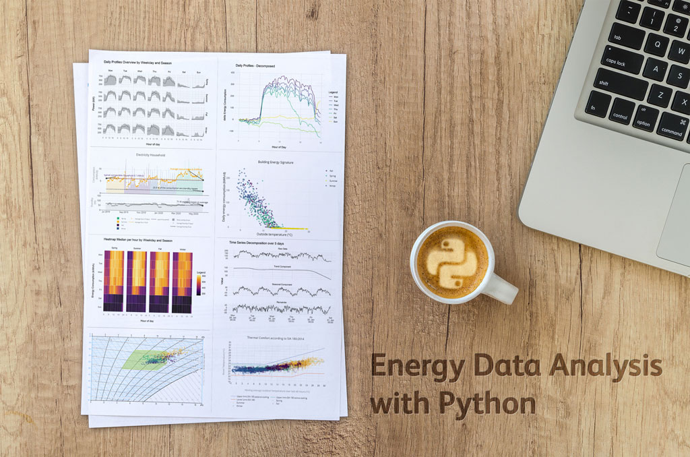

# Energy Data Analysis with Python



```{admonition} About this book
:class: tip
This book provides practical recipes for analyzing and visualizing energy and comfort time series data using Python. It is aimed at both beginners and experienced users in the field of building energy and indoor comfort.
```

## What you will learn

- How to **set up Python** and work with Jupyter Notebooks
- How to use **pandas** to load, transform, and analyze time series data
- How to handle **datetime objects** and time zones correctly
- How to perform **exploratory data analysis** (EDA) on building data
- How to assess **data quality** — detect gaps, outliers, and sensor failures
- How to create **meaningful visualizations** using Plotly and [pyedautils](https://pypi.org/project/pyedautils/)
- How to connect to **InfluxDB** time series databases using [influxdb-toolkit](https://pypi.org/project/influxdb-toolkit/)

## Who is this for?

This book is for engineers, data analysts, and researchers working with building energy and comfort data. Whether you are new to Python or an experienced user looking for domain-specific recipes, you will find practical examples and ready-to-use code.

## How to use this book

The book is structured in four parts:

1. **Getting Started** — Install Python, learn about Jupyter Notebooks, and set up your packages
2. **Python Basics** — Master the fundamentals of data loading, wrangling, time series, and data quality
3. **Data Visualizations** — Ready-to-use visualization recipes for energy and comfort data
4. **Appendix** — Package overview and additional resources

Each visualization recipe follows a consistent pattern: goal, data basis, data preparation, and visualization. Simply copy the code, run it, and replace the sample data with your own.

```{admonition} Inspiration
:class: note
This book is inspired by the [R Graphics Cookbook](https://r-graphics.org/) and [Engineering Data Analysis in R](https://hslu-ige-laes.github.io/edar/).
```
